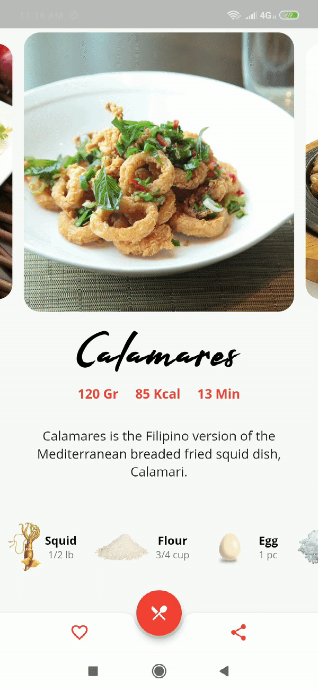

My entry to the Flutter Create challenge by google. https://flutter.dev/create

* [Awarded Honorable Mention](https://medium.com/flutter/the-flutter-create-winners-are-40980f2d20b3)

# Filipino Cuisine

A Flutter app that shows list of Filipino Food, it shows the recipe and instructions.

**Note**: This app needs internet connection for HTTP request.

**Asset License**: All images used on this app are under the "CC0 - Creative Commons" license

## Packages Used

* [http](https://pub.dartlang.org/packages/http)
* [flutter_swiper](https://pub.dartlang.org/packages/flutter_swiper)
* [flutter_launcher_icons](https://pub.dartlang.org/packages/flutter_launcher_icons)

## Developed By

* [John Mark Grancapal](https://www.linkedin.com/in/jmarkgrancapal/)

## License

    Copyright 2019 John Mark Grancapal

    Licensed under the Apache License, Version 2.0 (the "License");
    you may not use this file except in compliance with the License.
    You may obtain a copy of the License at

        http://www.apache.org/licenses/LICENSE-2.0

    Unless required by applicable law or agreed to in writing, software
    distributed under the License is distributed on an "AS IS" BASIS,
    WITHOUT WARRANTIES OR CONDITIONS OF ANY KIND, either express or implied.
    See the License for the specific language governing permissions and
    limitations under the License.
